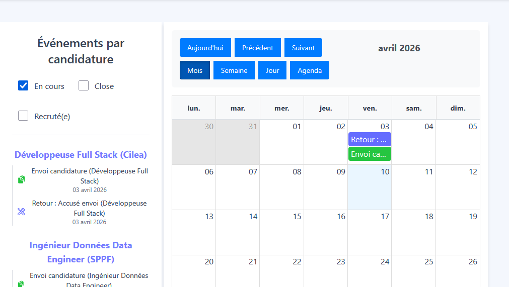
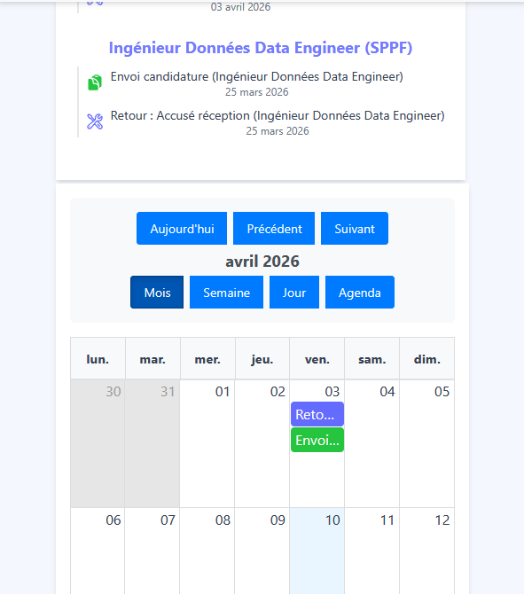

# 📅 Calendrier 📅

Une interface calendrier interactive permettant de visualiser, organiser et analyser les événements liés au suivi des candidatures à travers une représentation temporelle claire, structurée et exploitable.

---
## 🎯 1. Objectifs

* Fournir une **interface ergonomique et responsive** pour la visualisation temporelle des candidatures.
* Centraliser les **événements clés du processus de recrutement** (envoi, entretiens, actions, retours).
* Faciliter le **suivi et l’anticipation des actions** à réaliser.
* Mettre en place une **navigation fluide entre données structurées et visualisation calendrier**.
* Illustrer mes compétences en **gestion de données temporelles** et en **interfaces interactives**.

---
## 🛠️ 2. Stack technique

### a. Frontend

* **React v19** pour la structuration modulaire de l’interface.
* **react-big-calendar** pour la gestion avancée des vues calendaires.
* **dayjs** pour la manipulation et la localisation des dates (français).
* **Material Tailwind** pour la construction de l’interface utilisateur.
* **React Icons** pour la différenciation visuelle des événements.

### b. Backend

* **API REST** pour la récupération des données via `getAllCandidatureTotal()`.
* Transformation des données backend en **événements exploitables côté frontend**.

### c. Données

* Structuration des données issues des candidatures en **objets événementiels normalisés**.
* Agrégation et transformation permettant une **double représentation** :

  * Vue liste (groupée)
  * Vue calendrier (linéaire)

---
## 📊 3. Fonctionnalités principales

### Visualisation temporelle

* Affichage multi-vues :

  * Mois
  * Semaine
  * Jour
  * Agenda
* Navigation temporelle (précédent / suivant / aujourd’hui).
* Localisation complète en français.

---

### Structuration des événements

Les données sont transformées dynamiquement en événements :

* **Candidature** → date d’envoi
* **Rendez-vous** → entretiens planifiés
* **Actions** → tâches de suivi
* **Retours** → réponses ou feedback

Chaque type est enrichi par :

* Une **couleur spécifique**
* Une **icône dédiée**
* Une **gestion temporelle adaptée (journée entière ou horaire)**


### Filtrage des données

* Filtrage des candidatures par statut :

  * En cours
  * Close
  * Recruté(e)

* Possibilité d’affichage global en absence de filtre.


### Interaction et navigation

* Synchronisation entre :

  * Liste des événements
  * Calendrier

* Interactions utilisateur :

  * Clic calendrier → accès à l’événement dans la liste
  * Clic liste → positionnement dans le calendrier

* Mise en évidence dynamique des éléments sélectionnés.

---

## 🧩 4. Exemple de transformation des données

```ts
const pushEvent = (evt: Omit<MyEvent, "id">) => {
  const fullEvt: MyEvent = { ...evt, id: `evt-${idCounter++}` };
  grouped[key].events.push(fullEvt);
  flat.push(fullEvt);
};
```

Ce mécanisme permet de transformer des données métier en une structure adaptée à la visualisation calendrier.

---

## 🖥️ 5. Organisation de l’interface

L’interface est structurée en deux zones principales :

* **Zone latérale**

  * Liste des événements groupés par candidature
  * Filtres dynamiques

* **Zone principale**

  * Calendrier interactif

Cette organisation permet une **lecture rapide des données** tout en conservant une navigation efficace.

---

## 🖥️ 6. Captures d'écrans : 

🎴Ecran du calendrier :<br />
Ecran desktop<br>
<br>
Ecran mobile<br>
<br>

---

## 🚀 7. Compétences mises en avant

### a. Manipulation de données

* Transformation de données backend en structures exploitables
* Agrégation et normalisation d’événements
* Gestion de données temporelles

### b. Frontend avancé

* Utilisation de `React` avec :

  * `useMemo` pour l’optimisation
  * `useEffect` pour la récupération des données
  * Gestion d’état complexe

### c. Conception d’interface

* Mise en place d’une **interface interactive synchronisée**
* Gestion des interactions utilisateur avancées
* Organisation claire des données

### d. Gestion du temps

* Manipulation avancée des dates avec `dayjs`
* Formatage dynamique selon les vues
* Localisation complète

---

## 🎯 8. Conclusion

Ce module **Calendrier** illustre ma capacité à :

* Concevoir une application orientée **gestion temporelle des données**
* Structurer et transformer des données métier en visualisations exploitables
* Mettre en place une **interface interactive et synchronisée**
* Intégrer des composants avancés comme `react-big-calendar`
* Proposer une expérience utilisateur claire et efficace

Cette approche peut être étendue à tout système nécessitant une **visualisation temporelle de données** (gestion de projets, planning, suivi d’activité, etc.).

---

## 🚀 9. Perspectives d’évolution

### a. Interactivité avancée

* Drag et drop des événements
* Création / modification d’événements
* Synchronisation avec des calendriers externes

### b. Filtres dynamiques

* Filtrage par entreprise
* Filtrage par type d’événement
* Recherche multicritère

### c. Analyse temporelle

* Visualisation des périodes les plus actives
* Détection de tendances
* Analyse des délais entre étapes de candidature

### d. Notifications

* Rappels automatiques
* Alertes avant rendez-vous
* Notifications temps réel