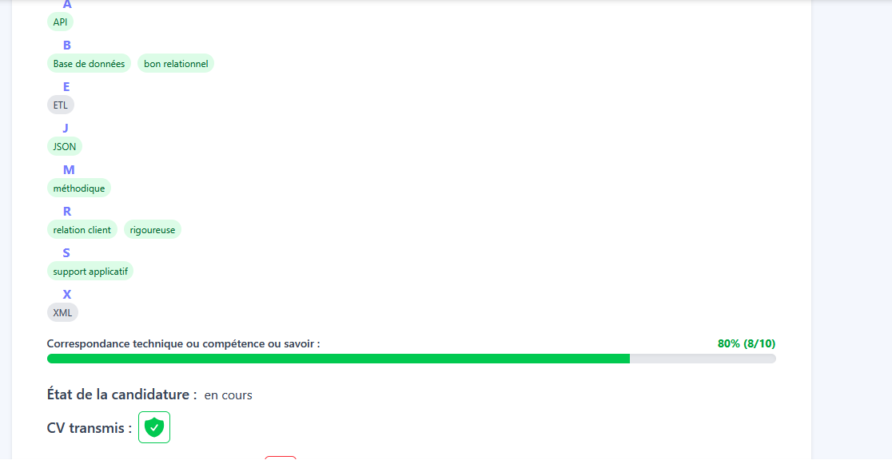
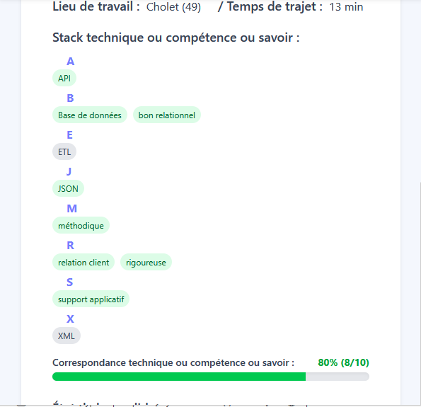

# 👩‍💻 Candidature 👩‍💻


Une interface complète de gestion et de visualisation d’une candidature permettant de centraliser, structurer et exploiter l’ensemble des informations liées au processus de recrutement, depuis l’envoi jusqu’au suivi des interactions.

---

## 🎯 1. Objectifs

* Fournir une **vue détaillée et centralisée** d’une candidature.
* Structurer et afficher les **données métier complexes** (documents, actions, retours, contacts…).
* Faciliter le **suivi du cycle de vie complet** d’une candidature.
* Mettre en place des **indicateurs visuels et analytiques** pour aider à la prise de décision.
* Illustrer mes compétences en **modélisation de données**, **logique métier** et **interfaces complexes**.

---

## 🛠️ 2. Stack technique

### a. Frontend

* **React v19** pour la gestion de l’interface et des états.
* **Material Tailwind** pour la structuration UI (cards, tooltips, boutons…).
* **React Router** pour la navigation dynamique.
* **React Icons** pour enrichir la lisibilité visuelle.

### b. Backend

* **API REST** pour :

  * Récupération d’une candidature (`getOneCandidatureTotal`)
  * Récupération globale (`getAllCandidatureTotal`)
  * Suppression (`deleteCandidature`)

* **API fichiers** pour le téléchargement de documents.

### c. Données

* Utilisation d’un modèle **CandidatureTotale** enrichi :

  * documents
  * contacts
  * stack technique
  * métadonnées

* Transformation des données via des fonctions dédiées :

  * `mapCandidatureToRetours`
  * `mapCandidatureToRendezvous`
  * `mapCandidatureToActions`
  * `mapCandidatureToContacts`
  * `mapCandidatureToSuites`

---

## 📊 3. Fonctionnalités

### Visualisation complète d’une candidature

* Affichage des informations principales :

  * Poste
  * Entreprise
  * Date d’envoi
  * Statut

* Accès direct :

  * Lien de l’offre
  * Documents associés
  * Entreprise liée


### Structuration des données métier

Les données sont transformées dynamiquement en entités exploitables :

* **Retours** → réponses reçues
* **Rendez-vous** → entretiens planifiés
* **Actions** → tâches de suivi
* **Contacts** → interactions avec recruteurs
* **Suites** → évolutions du processus

Cette transformation permet une **lecture claire et structurée** d’un ensemble de données hétérogènes.


### Timeline dynamique

* Construction d’une **timeline chronologique** à partir des événements :

  * retours
  * rendez-vous
  * actions
  * contacts
  * suites

* Tri automatique des événements par date

* Vision globale du **cycle de vie de la candidature**


### Analyse de la stack technique

* Affichage des compétences demandées regroupées par lettre

* Comparaison avec la stack utilisateur

* Calcul du **taux de correspondance** :

```ts id="stack-match"
const percentage = Math.round((matches / total) * 100);
```

* Indicateurs visuels :

  * Couleurs (vert / orange / rouge)
  * Barre de progression


### Gestion documentaire

* Indicateurs :

  * CV transmis / non transmis
  * Lettre de motivation transmise
  * Documents consultés par le recruteur

* Téléchargement des fichiers

* Visualisation rapide des statuts


### Export PDF

Génération dynamique d’un document complet :

* Structuration automatique du contenu

* Mise en forme (titres, sections, couleurs)

* Pagination

* Intégration :

  * informations générales
  * stack technique
  * retours
  * rendez-vous
  * actions

* Calculs intégrés :

  * correspondance technique
  * délais entre événements


### Gestion des actions utilisateur

* Suppression d’une candidature
* Navigation vers les entités liées
* Ouverture de documents

---

## 🧩 4. Exemple de transformation des données

```ts id="timeline"
const events: TimelineEvent[] = [];

retours.forEach(r => {
  events.push({
    type: 'retour',
    date: new Date(r.date),
    data: r
  });
});

return events.sort((a, b) => a.date.getTime() - b.date.getTime());
```

Ce mécanisme permet de reconstruire une **timeline unifiée** à partir de sources multiples.

---

## 🖥️ 5. Organisation de l’interface

L’interface est structurée autour d’une **card principale** contenant :

* Informations générales
* Détails du contrat
* Stack technique
* Documents
* Historique des interactions

Cette organisation permet une **lecture progressive et hiérarchisée** des informations.

---

## 🖥️ 6. Captures d'écrans : 

🎴Ecran partie de la page candidature :<br />
Ecran desktop<br>
<br>
Ecran mobile<br>
<br>

## 🚀 7. Compétences mises en avant

### a. Modélisation de données

* Structuration d’un modèle métier complexe
* Transformation de données hétérogènes
* Agrégation multi-sources


### b. Logique métier

* Gestion du cycle de vie d’une candidature
* Calculs métier (matching, délais…)
* Organisation chronologique des événements


### c. Frontend avancé

* Gestion d’état (`useState`, `useEffect`)
* Rendu conditionnel complexe
* Interaction utilisateur avancée


### d. Génération de documents

* Création dynamique de PDF
* Mise en page programmée
* Gestion multi-pages

---

## 🎯 8. Conclusion

Ce module **Candidature** illustre ma capacité à :

* Concevoir une **interface métier complète et structurée**
* Transformer des données complexes en informations exploitables
* Implémenter des **logiques avancées de traitement et d’analyse**
* Intégrer des fonctionnalités concrètes (export, téléchargement, navigation)
* Proposer une expérience utilisateur orientée **suivi et prise de décision**

Ce type d’architecture est applicable à tout système nécessitant la gestion d’un **cycle de vie d’entités complexes** (CRM, suivi client, gestion de projets, etc.).

---

## 🚀 9. Perspectives d’évolution

### a. Interactivité avancée

* Édition directe des données
* Ajout d’événements en temps réel
* Mise à jour dynamique de la timeline


### b. Analyse métier

* Calcul automatique de KPI :

  * taux de réponse
  * délai moyen de traitement
* Détection de patterns


### c. Automatisation

* Suggestions d’actions (relance, suivi…)
* Notifications intelligentes


### d. Expérience utilisateur

* Vue timeline graphique
* Filtrage des événements
* Mode résumé / détaillé
