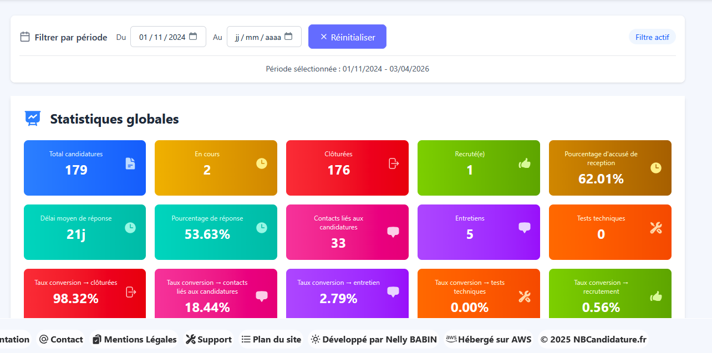
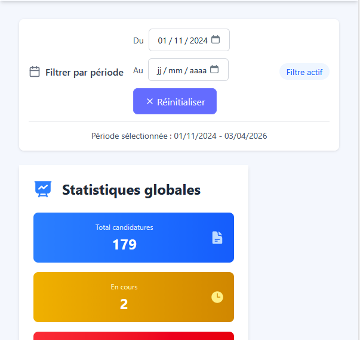
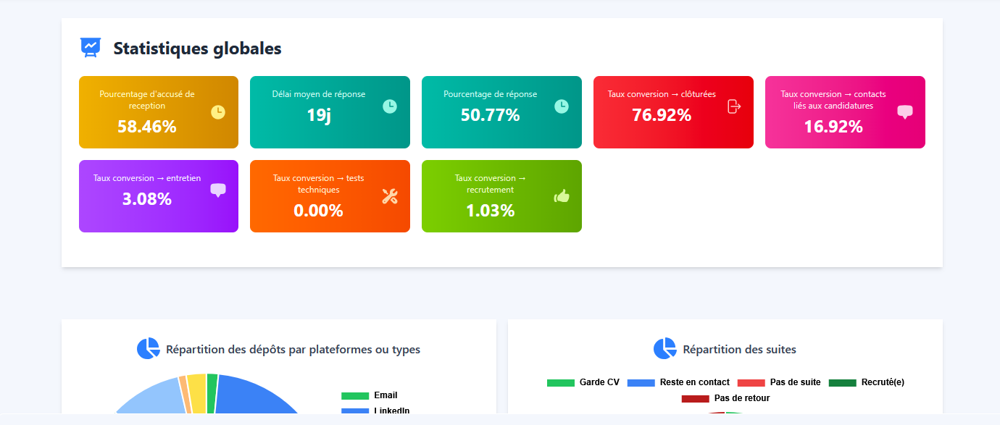
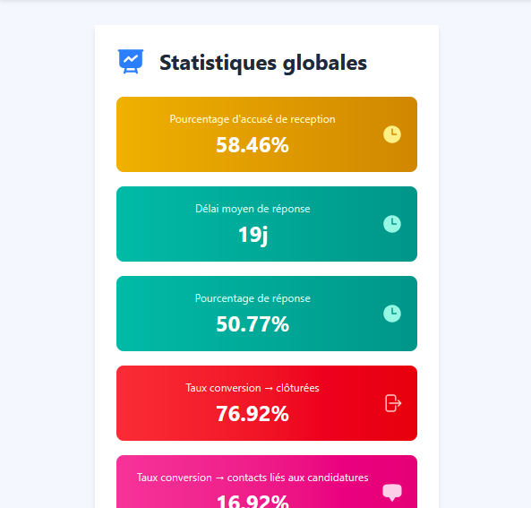

# 📅 Dashboard 📅

Un tableau de bord interactif permettant de visualiser et analyser les données et les statistiques de suivi des candidature à travers une interface claire, responsive et orientée data-visualisation.

---

## 🎯 1. Objectifs

- Fournir une **interface ergonomique et responsive** pour l’exploration de données de candidatures.  
- Mettre en œuvre des **statistiques** : globales, sur une période.
- Créer un dashboard utilisateur avec les données de ses candidatures et un dashboard public avec les données générales de tous les utilisateurs.  
- Appliquer des **bonnes pratiques de data engineering** (requêtes optimisées, organisation en cartes modulaires).  
- Illustrer mes compétences en **conception d’interfaces analytiques** et en **visualisation de données**.  

---

## 🛠️ 2. Stack technique

### a. Frontend
- **React v19** pour la mise en page responsive et modulaire.  
- **Chart.js** pour afficher les graphiques.   
- **Système de cartes** permettant de réorganiser ou étendre facilement le dashboard.
- Utiliser **React.lazy()** pour charger des composants card de manière asynchrone.<br>
L'utilisation de React.lazy() pour le code splitting et l’optimisation des performances (réduction du bundle initial). 
- Optimisation responsive (desktop / tablette / mobile).
- Le dashboard est constitué de différents composants card ce qui le rend facilement modifiable.  

### b. Backend
- **Express** côté serveur pour générer dynamiquement le contenu.  
- **Connexion à MongoDB** pour extraire les données stockées dans les différentes collections.  
- Requêtes pour agréger, filtrer et analyser les données (totaux, moyennes, ...).

### c. Données
- Avec `MongoDB`, l'agrégation consiste à obtenir des informations synthétiques. Pour ce faire, les données d'un ou de plusieurs documents sont analysées et filtrées en fonction de certains facteurs définis. 

---

## 📊 3. Fonctionnalités & Statistiques

### Statistiques globales
- Nombre total de candidatures  
- Nombre total de retours  
- Nombre total d'entreprises  
- Nombre total de contacts
- Nombre total d'entretiens
- Nombre total de tests techniques
- Nombre total de candidatures ayant abouti à un recrutement
- Nombre total de candidatures en cours
- Nombre total de candidatures closes
- Statistique des ratios pour ces données par rapport aux candidatures  

### Evolution des candidatures
- Comparaison semaine actuelle et semaine précédente
- Evolution par statut des candidatures sur une période
- Evolution des candidatures sur les dernières semaines

### Suivi des candidatures
- Affichage des 10 dernières candidatures en cours
- Affichage des prochains rendez-vous (≤ 8 jours)
- Affichage des actions à effectuer (≤ 8 jours)
  
### Statistiques par plateforme emploi
-  Nombre de candidatures
-  Taux de retour

### Statistiques des vues de CV ou profil
- Statistique de répartition des consultation par plateforme
- Statistique de contact suite à la consultation et / ou ayant abouti à un recrutement

### Répartition par données des offres
- Répartition des types de candidatures
- Répartition par type de contrat
- Répartition par condition de contrat

### Statistiques des stacks ou compétences
- Statistiques par stack ou compétences présentes dans les offres
- Visuel pour savoir si la stack ou compétence est l'un du candidat

---

## 🧩 4. Exemple d'une card

Extraits du code de la card ChartsPlateforme.tsx

```
// Agrégation des candidatures par plateforme
const counts = depotMeta.values.map((v) =>
  candidatures.filter((c) => c.depot === v.key).length
);

// Normalisation des couleurs (mapping Tailwind → HEX)
const colors = depotMeta.values.map((v) =>
  tailwindToHex[v.color] ?? "#9ca3af"
);

// Construction des données pour le graphique
const pieData = {
  labels: depotMeta.values.map((v) => v.label),
  datasets: [
    {
      data: counts,
      backgroundColor: colors,
    },
  ],
};
```
**Principes appliqués :**

* ✔️ Calcul dynamique des statistiques à partir des données MongoDB
* ✔️ Transformation des données en format exploitable par Chart.js
* ✔️ Normalisation des styles pour cohérence visuelle
* ✔️ Optimisation des performances via `useMemo`

---

## 🖥️ 5. Captures d'écrans : 

🎴Ecran du Dashboard utilisateur :<br />
Ecran desktop<br>
<br>
Ecran mobile<br>
<br>

🎴Ecran du Dashboard public :<br />
Ecran desktop<br>
<br>
Ecran mobile<br>
<br>

---

## 6. 🚀 Compétences mises en avant

### a. Base de données :

Conception et exploitation de données liées au suivi de candidatures.

Ecriture de requêtes complexes pour extractions, totaux, moyennes, ... .  

### b. Développement backend :
  
Génération dynamique de pages avec `Express`.

### c. Frontend moderne : 
  
Utilisation avancée de `React` pour une interface flexible :
- Gestion des performances (memoization, lazy loading)
- Architecture modulaire (cards dynamiques)
- Gestion d’état

### d. Data visualisation : 

Implémentation de métriques analytiques (globales et temporelles) permettant d’identifier les tendances et performances du processus de candidature.

---

## 🎯 7. Conclusion

Ce projet de **Dashboard** illustre ma capacité à :

- Concevoir et structurer une application web orientée **analyse de données**.  
- Exploiter une base de données `MongoDB` pour produire des statistiques riches et variées.  
- Mettre en œuvre un **backend en `Express`** pour générer du contenu dynamique.  
- Créer une **interface responsive moderne** grâce à **`CSS` Grid**.  
- Valoriser les résultats par une approche **data-visualisation claire et modulaire**.
- Utilisation de `Chart.js` pour afficher les histogrammes et les courbes.

Au-delà du suivi de candidatures, cette architecture peut être adaptée à tout type de données temporelles (ventes, capteurs IoT, monitoring, etc.).  
Elle démontre ma polyvalence entre **backend, frontend et analyse statistique**.

Vous pouvez voir le résultat ici :<br />
<a href="http://nbcandidature.fr/DashboardPublicPage" target="_blank" title="Dashboard - Vue d'ensemble">📰 Dashboard - Vue d'ensemble </a>

---

## 🚀 8. Perspectives d’évolution

Afin d’améliorer l’expérience utilisateur et la pertinence des analyses, plusieurs évolutions du dashboard peuvent être envisagées :

### a. Interactivité avancée

* Ajout de filtres dynamiques globaux (période, statut, plateforme, type de contrat)
* Synchronisation des filtres entre les différentes cards
* Possibilité de cliquer sur un graphique pour filtrer les autres visualisations (cross-filtering)

### b. Personnalisation du dashboard

* Réorganisation des cards via drag & drop
* Possibilité d’ajouter / supprimer des widgets selon les besoins utilisateur
* Sauvegarde de layouts personnalisés

### c. Analyse temporelle avancée

* Comparaison de périodes personnalisées (ex : mois vs mois précédent)
* Zoom sur des plages de temps spécifiques
* Visualisation des tendances long terme

### d. Aide à la décision

* Mise en avant automatique des anomalies ou tendances (ex : baisse des candidatures)
* Suggestions d’actions basées sur les données (ex : plateformes les plus performantes)
* Système d’alertes visuelles sur certains indicateurs