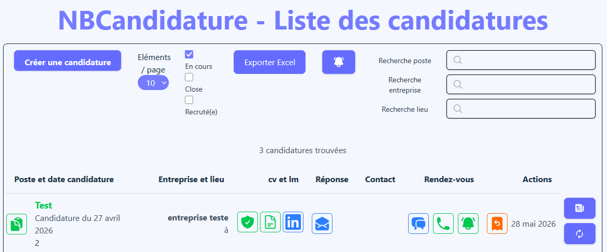
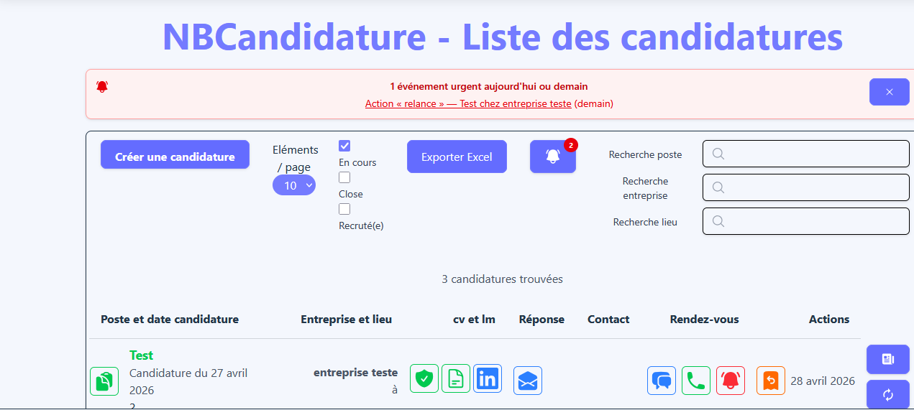
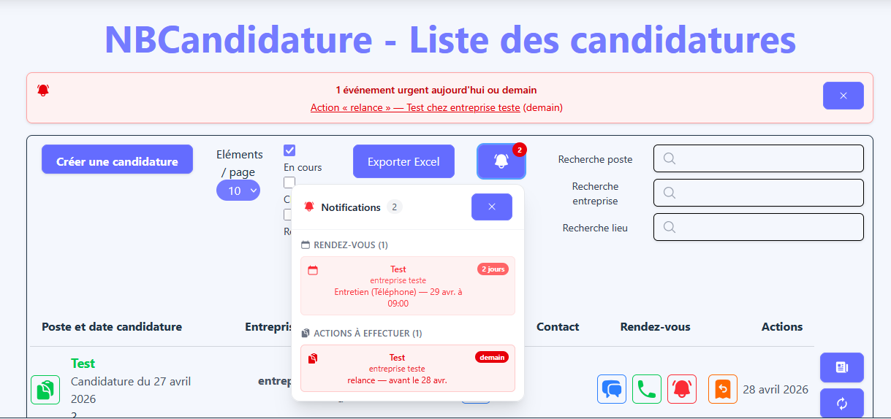

# 🔔 Notifications et alertes 🔔

Un système de notifications temps réel permettant d'alerter l'utilisateur sur ses rendez-vous et actions à venir à travers une interface claire, accessible et orientée urgence.

---

## 🎯 1. Objectifs

- Fournir une **alerte contextuelle et non intrusive** directement dans le dashboard, sans navigation supplémentaire.
- Mettre en œuvre une **logique de priorisation par urgence** : aujourd'hui, demain, dans les 8 jours.
- Proposer deux niveaux d'affichage : une **bannière automatique** pour les urgences immédiates et un **panneau déroulant** accessible via une cloche.
- Concevoir un composant **autonome ou piloté par le parent**, capable de fonctionner avec ou sans données injectées en props.
- Appliquer les **bonnes pratiques React** : memoization, lazy state, fermeture au clic extérieur, accessibilité ARIA.

---

## 🛠️ 2. Architecture du composant

Le système de notifications est composé de **trois sous-composants** distincts, organisés selon le principe de responsabilité unique :

```
NotificationsBell (orchestrateur)
├── UrgentBanner       → Bannière inline pour les urgences 0-1 jour
└── NotificationItem   → Ligne individuelle dans le panneau déroulant
```

### a. `NotificationsBell`

Composant principal qui gère :

- Le **fetch autonome** des candidatures si aucune prop n'est fournie (mode découplé)
- Le **calcul des notifications** via `useMemo`
- L'**état d'ouverture** du panneau et la fermeture au clic extérieur
- La **remontée des notifications** au composant parent via `onNotificationsReady`

### b. `UrgentBanner`

Composant mémoïsé affiché **automatiquement** en haut du dashboard lorsqu'un événement est prévu dans les 24-48h. Il est dismissible par l'utilisateur. Le parent contrôle sa visibilité via un état `bannerDismissed`.

### c. `NotificationItem`

Composant de présentation pour **une ligne de notification**. Il adapte son rendu selon le type (`rendezvous` ou `action`) et applique un code couleur dynamique selon l'urgence.

---

## 🧩 3. Modèle de données TypeScript

Deux types distincts modélisent les notifications, réunis dans un **type union discriminant** :

```ts
interface NotifRendezvous {
  kind: 'rendezvous';
  _id: string;
  poste: string;
  entrepriseId: string;
  entrepriseNom: string;
  date: Date;
  type: string;
  mode: string;
  jours: number;
}

interface NotifAction {
  kind: 'action';
  _id: string;
  poste: string;
  entrepriseId: string;
  entrepriseNom: string;
  dateLimite: Date;
  action: string;
  jours: number;
}

type CandidatureNotification = NotifRendezvous | NotifAction;
```

Le champ `kind` est un **discriminant de type** : il permet à TypeScript de restreindre automatiquement le type dans les conditions `if/switch`, garantissant un rendu typé sans cast.

---

## 📊 4. Fonctionnalités et Logique métier

### Calcul des notifications

Le calcul est réalisé dans un `useMemo` qui parcourt toutes les candidatures et en extrait les événements imminents :

```ts
const notifications: CandidatureNotification[] = useMemo(() => {
  const result: CandidatureNotification[] = [];

  function calendarDiff(target: Date): number {
    const todayMidnight = new Date();
    todayMidnight.setHours(0, 0, 0, 0);
    const targetMidnight = new Date(target);
    targetMidnight.setHours(0, 0, 0, 0);
    return Math.round(
      (targetMidnight.getTime() - todayMidnight.getTime()) / (1000 * 60 * 60 * 24)
    );
  }

  for (const c of candidatures) {
    // Rendez-vous
    const rendezvous = mapCandidatureToRendezvous(c);
    for (const doc of rendezvous) {
      let dateRdv = new Date(doc.date);
      if (doc.dateReport) dateRdv = new Date(doc.dateReport);
      const diff = calendarDiff(dateRdv);
      if (diff >= 0 && diff <= 8) {
        result.push({
          kind: 'rendezvous',
          _id: c._id ?? '',
          poste: c.poste,
          entrepriseId: c.entrepriseId ?? '',
          entrepriseNom: resolveEntreprise(c.entrepriseId ?? ''),
          date: dateRdv,
          type: doc.type ?? '',
          mode: doc.mode ?? '',
          jours: diff,
        });
      }
    }

    // Actions en attente
    const actions = mapCandidatureToActions(c);
    for (const actionName of actions) {
      const dateAction = new Date(actionName.date);
      const dateLimite = new Date(dateAction);
      dateLimite.setDate(dateLimite.getDate() + (actionName.delais || 0));
      const diff = calendarDiff(dateLimite);
      if (diff >= 0 && diff <= 8) {
        result.push({
          kind: 'action',
          _id: c._id ?? '',
          poste: c.poste,
          entrepriseId: c.entrepriseId ?? '',
          entrepriseNom: resolveEntreprise(c.entrepriseId ?? ''),
          dateLimite,
          action: actionName.type,
          jours: diff,
        });
      }
    }
  }

  return result.sort((a, b) => a.jours - b.jours);
// eslint-disable-next-line react-hooks/exhaustive-deps
}, [candidatures, entreprises]);
```

**Principes appliqués :**

* ✔️ Fenêtre glissante de 8 jours pour filtrer les événements imminents
* ✔️ Gestion du report de date pour les rendez-vous décalés
* ✔️ Calcul de date limite dynamique pour les actions (date + délai configuré)
* ✔️ Tri automatique par urgence croissante
* ✔️ Optimisation des performances via `useMemo`

---

### Système de priorisation par urgence

Trois niveaux d'urgence sont définis et se propagent visuellement dans tout le composant :

| Délai         | Couleur badge | Couleur item            | Libellé affiché |
|---------------|---------------|-------------------------|-----------------|
| Aujourd'hui   | Rouge foncé   | `text-red-600 bg-red-50` | `aujourd'hui`  |
| Demain        | Rouge         | `text-red-500 bg-red-50` | `demain`       |
| 2 à 8 jours   | Orange        | `text-orange-500 bg-orange-50` | `X jours` |

```ts
function urgencyColorClass(jours: number): string {
  if (jours <= 1) return 'text-red-600 bg-red-50 border-red-200';
  if (jours <= 3) return 'text-red-500 bg-red-50 border-red-100';
  return 'text-orange-500 bg-orange-50 border-orange-100';
}
```

---

### Mode autonome vs. mode piloté

Le composant expose une interface de props flexible :

```ts
interface NotificationsBellProps {
  /**
   * Liste des candidatures à analyser.
   * Si omis, le composant fetchera toutes les candidatures lui-même —
   * utile sur les pages paginées où le parent n'a qu'une page de données.
   */
  candidatures?: Candidature[];
  /** Callback appelé une fois les notifications calculées */
  onNotificationsReady?: (notifications: CandidatureNotification[]) => void;
}
```

- **Mode piloté** : le parent fournit `candidatures` (cas du Dashboard qui charge déjà toutes les données)
- **Mode autonome** : sans prop, le composant lance son propre `getCandidature()` au montage — utile sur les pages paginées qui n'ont accès qu'à une portion des données
  (cas de la liste des candidatures avec pagination côté back).

---

### Fermeture au clic extérieur

Un `useEffect` attache un listener `mousedown` sur le document lorsque le panneau est ouvert, et le retire à la fermeture :

```ts
useEffect(() => {
  function handleClickOutside(e: MouseEvent) {
    if (panelRef.current && !panelRef.current.contains(e.target as Node)) {
      setOpen(false);
    }
  }
  if (open) document.addEventListener('mousedown', handleClickOutside);
  return () => document.removeEventListener('mousedown', handleClickOutside);
}, [open]);
```

---

## 🔗 5. Intégration dans le `DashboardPage`

Le composant s'intègre dans la barre de contrôle du dashboard aux côtés du filtre de période. La communication parent ↔ enfant repose sur le callback `onNotificationsReady` :

```tsx
// Dans DashboardPage
const [notifications, setNotifications] = useState<CandidatureNotification[]>([]);
const [bannerDismissed, setBannerDismissed] = useState(false);

const handleNotificationsReady = useCallback((notifs: CandidatureNotification[]) => {
  setNotifications(notifs);
  // Réafficher la bannière si de nouvelles urgences apparaissent
  if (notifs.some((n) => n.jours <= 1)) setBannerDismissed(false);
}, []);

// Rendu
{!bannerDismissed && (
  <UrgentBanner
    notifications={notifications}
    onDismiss={() => setBannerDismissed(true)}
  />
)}

<NotificationsBell
  candidatures={candidatures}
  onNotificationsReady={handleNotificationsReady}
/>
```

**Flux de données :**

```
DashboardPage
  └─ fetchAllData() → candidatures[]
       └─ NotificationsBell (prop candidatures)
            └─ useMemo → CandidatureNotification[]
                 └─ onNotificationsReady → DashboardPage.notifications
                      └─ UrgentBanner (bannière automatique)
```

---

## ✨ 6. Détails UI et Accessibilité

### Animation de la cloche

Une animation CSS `wiggle` est injectée via un `<style>` tag inline pour contourner la limitation de Tailwind en dehors de sa configuration :

```css
@keyframes wiggle {
  0%, 100% { transform: rotate(0deg); }
  15%       { transform: rotate(-12deg); }
  30%       { transform: rotate(12deg); }
  45%       { transform: rotate(-8deg); }
  60%       { transform: rotate(8deg); }
  75%       { transform: rotate(-4deg); }
  90%       { transform: rotate(4deg); }
}
```

L'animation ne se déclenche que si `hasUrgent` est vrai (≤ 3 jours), et se joue **3 fois** au montage via `animate-[wiggle_1s_ease-in-out_3]`.

### Badge de comptage

Le badge sur la cloche affiche le nombre total de notifications. Au-delà de 9, il affiche `9+` pour rester lisible. Sa couleur suit le même code d'urgence que les items :

```tsx
{total > 0 && (
  <span className={`absolute -right-1 -top-1 ... ${hasUrgent ? 'bg-red-600' : 'bg-orange-400'}`}>
    {total > 9 ? '9+' : total}
  </span>
)}
```

### Accessibilité

- Attribut `aria-label` sur le bouton cloche : `Notifications (N)`
- Attributs `aria-label="Fermer"` sur les boutons de fermeture
- Navigation par lien (`<Link>`) sur chaque item pour accéder directement à la candidature concernée
- Focus ring visible sur le bouton principal : `focus:ring-2 focus:ring-blue-400`

---

## 🖥️ 7. Captures d'écrans

🎴 Cloche sans notification :<br />
<br>

🎴 Cloche avec badge d'urgence et bannière d'urgence :<br />
<br>

🎴 Panneau déroulant ouvert :<br />
<br>

---

## 🚀 8. Compétences mises en avant

### a. Architecture React avancée

Conception d'un composant **multi-mode** (autonome / piloté) avec une interface de props flexible et une communication bidirectionnelle parent ↔ enfant via callback.

### b. TypeScript et typage métier

Utilisation de **types union discriminants** (`kind: 'rendezvous' | 'action'`) pour un rendu conditionnel entièrement typé, sans recours à `any` ni cast.

### c. Optimisation des performances

Application systématique de `useMemo` pour le calcul des notifications et `memo()` pour les composants de présentation, évitant les re-rendus inutiles lors des mises à jour du parent.

### d. Logique métier temporelle

Calcul dynamique des délais, gestion des reports de dates et des délais configurables par action, tri et filtrage dans une fenêtre glissante de 8 jours.

### e. UX et accessibilité

Système d'alerte à deux niveaux (bannière + panneau), animation contextuelle, code couleur cohérent, attributs ARIA et fermeture au clic extérieur pour une expérience utilisateur fluide et inclusive.

---

## 🎯 9. Conclusion

Ce composant **NotificationsBell** illustre ma capacité à :

- Concevoir une **logique d'alerte métier** rigoureuse (priorités, délais, reports).
- Exploiter les **patterns React avancés** (useMemo, memo, useRef, useCallback, lazy state).
- Produire un composant **réutilisable et découplé**, intégrable dans n'importe quelle page.
- Maintenir une **cohérence visuelle** entre les niveaux d'urgence à travers l'ensemble de l'interface.
- Garantir l'**accessibilité** avec les attributs ARIA appropriés.

---

## 🔮 10. Perspectives d'évolution

### a. Persistance des dismissals

- Mémorisation via `localStorage` des bannières déjà fermées par l'utilisateur pour une session donnée, évitant leur réapparition au rechargement.

### b. Notifications push

- Intégration de l'**API Web Push** (Service Worker + Push API) pour notifier l'utilisateur même lorsque l'application est fermée.

### c. Centré sur l'utilisateur

- Ajout d'un bouton **"Marquer comme vu"** par notification pour en réduire le compteur sans fermer le panneau.
- Historique des notifications consultées.

### d. Filtrage dans le panneau

- Filtre rapide par type (`Rendez-vous` / `Actions`) directement dans le panneau déroulant.
- Tri paramétrable (par date, par urgence, par entreprise).